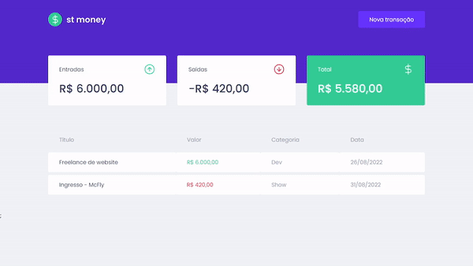

## Visualização | ST Money

<h1 align="center">
    
</h1>

<a href="/">Acesse a página 💰</a>

## 💻 Projeto

O ST Money foi um projeto feito em ReactJS com o objetivo de colocar em prática conhecimentos sobre Typescript, requisição de API, contexto e styled-components. Ele é um projeto de controle de finanças pessoais, permitindo o cadastro de entradas, saídas e a visualização do total em caixa. Cada transação tem descrição, valor, tipo, categoria e data de realização, de forma a facilitar sua identificação.

## 🧬 Tecnologias
Este projeto foi desenvolvido utilizando as seguintes tecnologias:
* [React](https://pt-br.reactjs.org/)
* [Styled-Components](https://styled-components.com/)
* [Typescript](https://www.typescriptlang.org/)
* [Axios](https://axios-http.com/ptbr/)
* [MirageJs](https://miragejs.com/)
* [React Modal](http://reactcommunity.org/react-modal/)
* [Polished](https://polished.js.org/docs/)
* [Context](https://pt-br.reactjs.org/docs/context.html)

## 📖 Conhecimento
Com o ST Money, aprendi a utilizar: 
* `Typescript` para adicionar tipagens ao JavaScript;
* `styled-components` para que a estilização seja restrita a cada componente;
* `MirageJS` para construir uma API fake dentro do Front-End;
* `axios` para fazer requisição HTTP;
* `react-modal`, que traz funcionalidades prontas de modal;
* `contextos` para compartilhar os dados das transações entre componentes.

## Utilização do projeto

### 💾 Baixar o projeto
Faça o clone do repositório para ter uma versão do projeto em sua máquina: 
`$ git clone https://github.com/mmanaclara/ignite-stmoney.git`

### 🧰 Instalar dependências
`$ npm install ou yarn`  

### 🚀 Iniciar o projeto
`$ npm start ou yarn start`

## 📝 Licença
Este projeto está licenciado nos termos da licença [MIT](https://github.com/mmanaclara/ignite-stmoney/blob/main/LICENSE). 

<a href="#topo">⬆</a>

